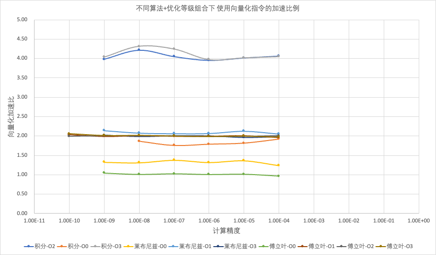
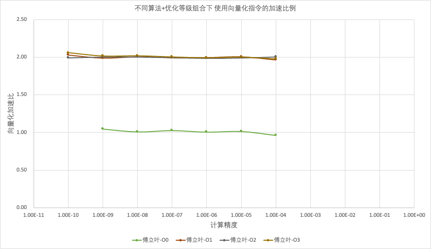
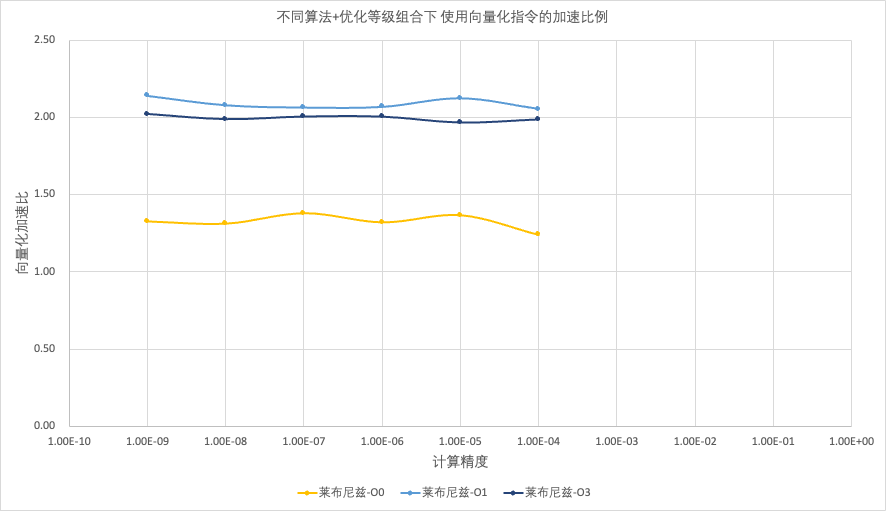
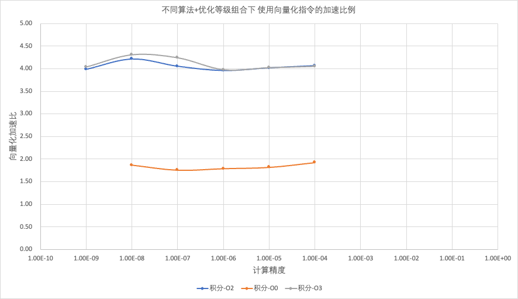
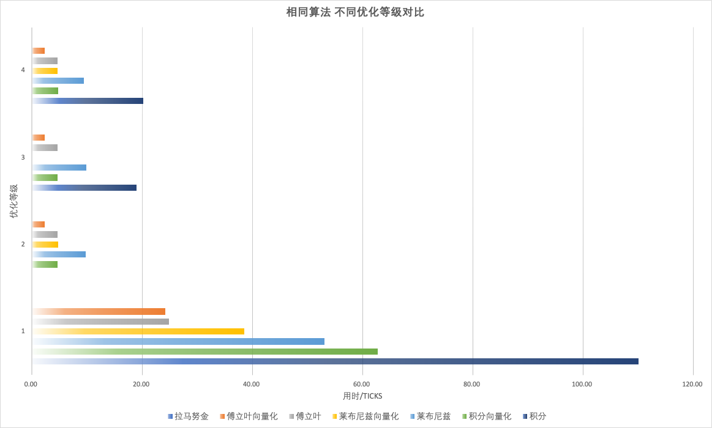
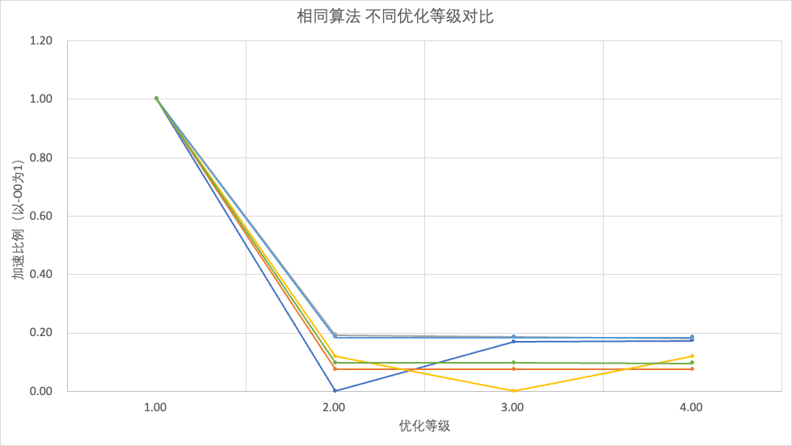
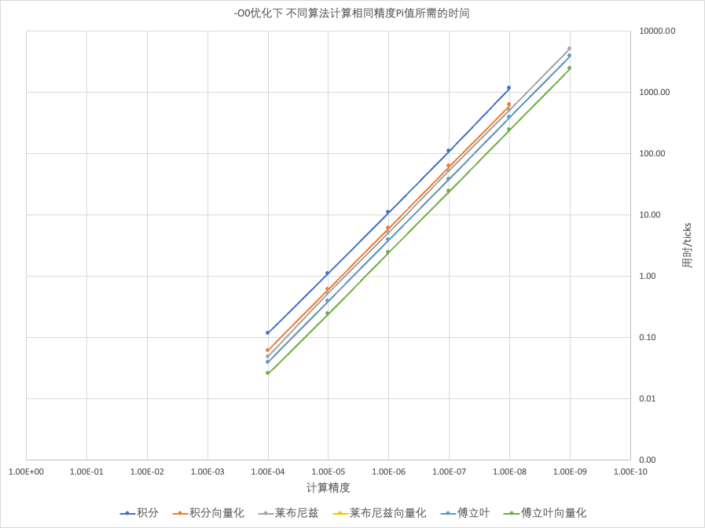

### 汇编与接口探究实验2

### 刘思锐 3200102708

# 一、背景说明

说到通过使用向量化指令加速的方式充分发挥处理器性能，自然而然会想到CPU性能测试中的经典项目——算圆周率。

下面将通过四种不同的数学方法逼近圆周率Pi，每种分别通过简单循环和256bit-AVX向量化指令进行计算，对比得到相同精度结果时用时的长短。

# 二、探究过程

## 2.1 方法说明

本次探究的核心是对比各个不同算法不同实现的用时长短。为了减小随机误差，下面提及的所有函数均采用多次计算取平均值的方法统计用时，具体实现如下：

```C++
int main() {
    long long ratio = 10;
    for (int i = 0; i < 1; i++) {
        test(ratio);
        ratio *= 10;
    }
}

void test(long long ratio) {
    clock_t start, end;
  	// dt用于控制精度，与ratio反相关
  	// 由于不同数学方法的逼近速度不同，dt的具体取值将随方法的变化而变化
    size_t dt = ...;
    double result;

    start = clock();
    // 精度越小，单轮计算用时越短，为控制总用时循环次数也越多
    for (int i = 0; i < 1 * ratio; i++) {
        result = FunctionToTest(dt);
    }
    end = clock();
    cout << result1 << "\t" << end - start << endl << endl;
}
```

定义精度为Pi的计算值与真实值之差的理论上界（不考虑浮点数表示与运算过程损失精度），dt为不同算法下达到所需精度的最小循环次数。

经实验，上面的测试方法能够保证了每一次外层迭代用时均在$10^4$到$10^5$数量级（单位ticks）。

工程在Windows 11 22H2环境下使用G++ 6.3.0编译器编译。为了启用AVX指令，编译时需要手动添加参数`-mavx`；为了排除编译器自动优化对结果产生影响，每一轮测试都会分别使用`-O0`、`-O1`、`-O2`、`-O3`四种不同的优化等级分别统计结果。

测试使用的处理器为Intel I3-12100F。

## 2.2 模拟积分法

模拟积分法中使用的数学公式是：
$$
\frac{\pi}{4}=\int_{0}^{1}{\frac{1}{1+x^2}}dx
$$
程序将设置一个相对较小的值作为dx，进行1/dx次求和运算。容易看出步长$dx$可以作为计算值$\frac{\pi}{4}$精度的下界，同时为了控制迭代用时，这里取`dt = 4 * 1e10 / ratio;`。

代码实现如下：

```c++
// 循环版本
double piIntegrationNaive(size_t dt) {
    double pi = 0.0;
    double delta = 1.0 / dt;
    for (size_t i = 0; i < dt; i++) {
      	// 简单的累和
        double x = (double) i / dt;
        pi += delta / (1 + x * x);
    }
    return pi * 4.0;
}

// 向量化版本
double piIntegrationAVX(size_t dt) {
    double pi = 0.0;
    double delta = 1.0 / dt;
    __m256d sgn_p_vec, delta_vec, base_vec, temp_vec, res_vec;
    sgn_p_vec = _mm256_set1_pd(1.0);
    delta_vec = _mm256_set1_pd(delta);
    base_vec = _mm256_set_pd(delta * 3, delta * 2, delta, 0.0);
    res_vec = _mm256_setzero_pd();
    for (size_t i = 0; i < dt - 4; i += 4) {
        // 计算当前循环的四个x值
        temp_vec = _mm256_set1_pd(i * delta);
        temp_vec = _mm256_add_pd(temp_vec, base_vec);
      	// 计算积分项的值
        temp_vec = _mm256_mul_pd(temp_vec, temp_vec);
        temp_vec = _mm256_add_pd(sgn_p_vec, temp_vec);
        temp_vec = _mm256_div_pd(delta_vec, temp_vec);
        // 结果累和
      	res_vec = _mm256_add_pd(res_vec, temp_vec);
    }
    double res[4] __attribute__((aligned(32)));
    _mm256_store_pd(res, res_vec);
    pi += res[0] + res[1] + res[2] + res[3];
    return pi * 4.0;
}
```

普通循环版本测试结果如下：

| 精度     | O0用时   | O1用时   | O2用时   | O3用时   |
| -------- | -------- | -------- | -------- | -------- |
| 1.00E-04 | 1.18E-01 | 2.86E-06 | 1.92E-02 | 1.92E-02 |
| 1.00E-05 | 1.11E+00 | 3.96E-06 | 1.91E-01 | 1.89E-01 |
| 1.00E-06 | 1.10E+01 | 6.76E-06 | 1.87E+00 | 1.88E+00 |
| 1.00E-07 | 1.10E+02 | 6.68E-06 | 1.90E+01 | 2.02E+01 |
| 1.00E-08 | 1.18E+03 | 5.66E-06 | 1.98E+02 | 2.04E+02 |
| 1.00E-09 | 时间过长 | 1.88E+03 | 1.88E+03 | 1.92E+03 |
| 1.00E-10 | 时间过长 | 时间过长 | 时间过长 | 时间过长 |

AVX向量化版本测试结果如下：

| 精度     | O0用时   | O1用时   | O2用时   | O3用时   |
| -------- | -------- | -------- | -------- | -------- |
| 1.00E-04 | 6.12E-02 | 4.48E-03 | 4.72E-03 | 4.73E-03 |
| 1.00E-05 | 6.13E-01 | 4.80E-02 | 4.76E-02 | 4.70E-02 |
| 1.00E-06 | 6.14E+00 | 4.68E-01 | 4.74E-01 | 4.74E-01 |
| 1.00E-07 | 6.27E+01 | 4.68E+00 | 4.68E+00 | 4.76E+00 |
| 1.00E-08 | 6.30E+02 | 4.71E+01 | 4.70E+01 | 4.72E+01 |
| 1.00E-09 | 6.25E+03 | 4.78E+02 | 4.72E+02 | 4.76E+02 |
| 1.00E-10 | 时间过长 | 4.71E+03 | 4.69E+03 | 4.71E+03 |

## 2.3 莱布尼兹展开法

对arctan函数使用莱布尼兹展开可以得到表达式：
$$
\frac{\pi}{4}=arctan(1)=\Sigma^{\infty}_{n=0}\frac{(-1)^n}{2n+1}
=1-\frac{1}{3}+\frac{1}{5}-\frac{1}{7}+\frac{1}{9}...
$$
显然精度不大于累和最后一项的绝对值，这里同样取`dt = 4 * 1e10 / ratio;`。

代码实现如下：

```C++
// 循环版本
double piLeibnizNaive(size_t dt) {
    double res = 0;
    for (size_t i = 1; i < dt; i += 4) {
        res += 1.0 / i;
    }
    for (size_t i = 3; i < dt; i += 4) {
        res -= 1.0 / i;
    }

    return res * 4;
}

// 向量化版本
double piLeibnizAVX(size_t dt) {
    __m256d base, sgn_p, sgn_n, temp, res_vec;
    base = _mm256_set_pd(0, 4, 8, 12);
    sgn_p = _mm256_set1_pd(1.0);
    sgn_n = _mm256_set1_pd(-1.0);
    res_vec = _mm256_set1_pd(0);
    double res = 0;
  
  	// 符号为正的项累和
    for (size_t i = 1; i < dt; i += 16) {
        temp = _mm256_set1_pd(i);
        temp = _mm256_add_pd(base, temp);
        temp = _mm256_div_pd(sgn_p, temp);
        res_vec = _mm256_add_pd(res_vec, temp);
    }
    double tmp[4] __attribute__((aligned(32)));
    _mm256_store_pd(tmp, res_vec);
    res += tmp[0] + tmp[1] + tmp[2] + tmp[3];
    res_vec = _mm256_set1_pd(0);
		
  	// 符号为负的项累和
    for (size_t i = 3; i < dt; i += 16) {
        temp = _mm256_set1_pd(i);
        temp = _mm256_add_pd(base, temp);
        temp = _mm256_div_pd(sgn_n, temp);
        res_vec = _mm256_add_pd(res_vec, temp);
    }
    _mm256_store_pd(tmp, res_vec);
    res += tmp[0] + tmp[1] + tmp[2] + tmp[3];
    return res * 4;
}
```

普通循环版本测试结果如下：

| 精度     | O0用时   | O1用时   | O2用时   | O3用时   |
| -------- | -------- | -------- | -------- | -------- |
| 1.00E-04 | 4.87E-02 | 9.74E-03 | 9.55E-03 | 9.48E-03 |
| 1.00E-05 | 5.32E-01 | 9.86E-02 | 9.46E-02 | 9.51E-02 |
| 1.00E-06 | 5.14E+00 | 9.75E-01 | 9.71E-01 | 9.49E-01 |
| 1.00E-07 | 5.31E+01 | 9.79E+00 | 9.92E+00 | 9.45E+00 |
| 1.00E-08 | 5.14E+02 | 9.88E+01 | 9.68E+01 | 9.40E+01 |
| 1.00E-09 | 5.19E+03 | 1.00E+03 | 9.64E+02 | 9.44E+02 |
| 1.00E-10 | 时间过长 | 时间过长 | 时间过长 | 时间过长 |

AVX向量化版本测试结果如下：

| 精度     | O0用时   | O1用时   | O2用时   | O3用时   |
| -------- | -------- | -------- | -------- | -------- |
| 1.00E-04 | 3.93E-02 | 4.74E-03 | 9.16E-06 | 4.77E-03 |
| 1.00E-05 | 3.90E-01 | 4.64E-02 | 1.04E-05 | 4.84E-02 |
| 1.00E-06 | 3.90E+00 | 4.72E-01 | 6.76E-06 | 4.74E-01 |
| 1.00E-07 | 3.86E+01 | 4.74E+00 | 8.20E-06 | 4.72E+00 |
| 1.00E-08 | 3.92E+02 | 4.75E+01 | 7.76E-06 | 4.73E+01 |
| 1.00E-09 | 3.92E+03 | 4.68E+02 | 8.40E-06 | 4.67E+02 |
| 1.00E-10 | 时间过长 | 4.73E+03 | 9.92E-06 | 4.70E+03 |

## 2.4 傅立叶展开法

利用傅立叶级数：
$$
x=\frac{4}{\pi}\Sigma^{\infty}_{n=0}(-1)^n\frac{sin(2n+1)x}{(2n+1)^2}
$$
取$x=\frac{\pi}{2}$，可以得到计算Pi的表达式：
$$
\frac{\pi^2}{8}=\Sigma^\infty_{n=0}\frac{1}{(2n+1)^2}
=1+\frac{1}{3^2}+\frac{1}{5^2}+\frac{1}{7^2}+\frac{1}{9^2}...
$$
两侧取微分，可以得到最终结果的精度不大于累和的最后一项乘以系数$\frac{\pi}{4}$，取`dt = 3.14 / 4 * 1e10 / ratio;`。

代码实现如下：

```C++
// 循环版本
double piFourierNaive(size_t dt) {
    double res = 0;
    for (size_t i = 1; i < dt; i += 2) {
        res += 1.0 / (i * i);
    }
  
    return std::sqrt(res * 8);
}

// 向量化版本
double piFourierAVX(size_t dt) {
    __m256d base, temp, res_vec, sgn_p;
    sgn_p = _mm256_set1_pd(1);
    base = _mm256_set_pd(0, 2, 4, 6);
    res_vec = _mm256_set1_pd(0);
    double res = 0;
    for (size_t i = 1; i < dt; i += 8) {
      	// 得到本轮4个n的值
        temp = _mm256_set1_pd(i);
        temp = _mm256_add_pd(base, temp);
      	// 运算
        temp = _mm256_mul_pd(temp, temp);
        temp = _mm256_div_pd(sgn_p, temp);
      	// 累和
        res_vec = _mm256_add_pd(res_vec, temp);
    }
    double tmp[4] __attribute__((aligned(32)));
    _mm256_store_pd(tmp, res_vec);
    res += tmp[0] + tmp[1] + tmp[2] + tmp[3];
    return std::sqrt(res * 8);
}
```

普通循环版本测试结果如下：

| 精度     | O0用时   | O1用时   | O2用时   | O3用时   |
| -------- | -------- | -------- | -------- | -------- |
| 1.00E-04 | 2.47E-02 | 4.70E-03 | 4.70E-03 | 4.72E-03 |
| 1.00E-05 | 2.46E-01 | 4.73E-02 | 4.70E-02 | 4.71E-02 |
| 1.00E-06 | 2.48E+00 | 4.72E-01 | 4.71E-01 | 4.74E-01 |
| 1.00E-07 | 2.49E+01 | 4.70E+00 | 4.71E+00 | 4.70E+00 |
| 1.00E-08 | 2.47E+02 | 4.72E+01 | 4.70E+01 | 4.73E+01 |
| 1.00E-09 | 2.56E+03 | 4.72E+02 | 4.72E+02 | 4.72E+02 |
| 1.00E-10 | 时间过长 | 4.78E+03 | 4.70E+03 | 4.92E+03 |

AVX向量化版本测试结果如下：

| 精度     | O0用时   | O1用时   | O2用时   | O3用时   |
| -------- | -------- | -------- | -------- | -------- |
| 1.00E-04 | 2.56E-02 | 2.39E-03 | 2.34E-03 | 2.39E-03 |
| 1.00E-05 | 2.43E-01 | 2.36E-02 | 2.36E-02 | 2.36E-02 |
| 1.00E-06 | 2.46E+00 | 2.37E-01 | 2.37E-01 | 2.38E-01 |
| 1.00E-07 | 2.42E+01 | 2.36E+00 | 2.36E+00 | 2.34E+00 |
| 1.00E-08 | 2.45E+02 | 2.35E+01 | 2.35E+01 | 2.34E+01 |
| 1.00E-09 | 2.44E+03 | 2.37E+02 | 2.36E+02 | 2.34E+02 |
| 1.00E-10 | 时间过长 | 2.35E+03 | 2.36E+03 | 2.39E+03 |

## 2.5 拉马努金公式

印度数学家拉马努金写出过下面这个壮观的公式：
$$
\frac{1}{\pi}=\frac{2\sqrt{2}}{99^2}\Sigma^{\infty}_{n=0}\frac{(4n)!}{(n!)^4}\frac{26390n+1103}{396^{4n}}
$$
当取第一项时，有效数字为7位：
$$
\pi\approx\frac{9801}{4412}\sqrt{2}=3.141592\underline{730...}
$$
取前两项的和时，有效数字为16位：
$$
\pi\approx\frac{9801}{4412+\frac{27493}{256158936}}\sqrt{2}=3.141592653589793\underline{878...}
$$
代码实现如下：

```C++
// 拟合速度过快，加之阶乘将很快超过long long的范围
// 这里至多算到第四项，甚至用不上向量化
double Ramanujan(int iter) {
    long long factorial[17];
    factorial[0] = 1;
    factorial[1] = 1;
    for (int i = 2; i <= iter * 4; i++) {
        factorial[i] = factorial[i - 1] * i;
    }

    double res = 0, temp = 0;
    for (int i = 0; i < iter; i++) {
        temp = factorial[4 * i];
        temp /= std::pow(factorial[i], 4);
        temp /= std::pow(396, 4 * i);
        temp *= 26390 * i + 1103;
        res += temp;
    }
    res *= 2 * std::sqrt(2);
    res /= 99 * 99;
    return 1.0 / res;
}
```

测试结果如下：

| 求和项数       | O0用时   | O1用时   | O2用时   | O3用时   |
| -------------- | -------- | -------- | -------- | -------- |
| 1（精度1E-07） | 3.02E-05 | 2.41E-05 | 1.98E-05 | 3.40E-06 |
| 2（精度1E-16） | 6.93E-05 | 4.85E-05 | 4.15E-05 | 2.49E-06 |
| 3              | 1.17E-04 | 8.59E-05 | 7.91E-05 | 8.09E-05 |
| 4              | 1.69E-04 | 1.28E-04 | 1.19E-04 | 1.16E-04 |

# 三、结果分析

## 3.1 向量化角度

从使用向量化指令以提升性能的角度，大部分算法使用AVX指令之后，相比常规的迭代程序都有非常可观的性能进步。參测的算法+优化等级组合中，有超过一半使用AVX后带来了两倍左右的加速比例；进步最大的积分法更是带来了4倍左右的加速比，已经达到了256bit向量的理论上限；即使是最差的情况下，加入向量化指令也至少没有对程序造成负面影响。这可以解释为何在类似的累和运算使用得非常多的科学计算领域，比如Matlab和Numpy，向量化指令得到了非常广泛的应用。



编译器优化中相当重要的一部分就是并行化优化，我原本猜想随着优化等级的提高，尤其是在自动向量化加入后，常规算法与并行指令算法之间的差距将有所缩小。但从图表中可以发现一个有趣的现象：当使用`-O0`关闭编译器优化，程序运行速度最慢的同时，并行化指令能够获得的性能提升幅度也显著低于开启编译器优化时；而使用`-O3`优化等级取得的加速比例与`-O1`、`-O2`并没有显著的区别。







## 3.2 编译器优化角度

下图中优化等级1-4，对应编译器命令`-O0`-` -O3`。可以看出，编译器优化普遍为各种算法带来了5-10倍的加速比，其效果远高于使用向量化指令。同时测试中还出现了“超级优化”的现象，比如对莱布尼兹向量化方法使用`-O2`优化、对积分法使用`-O1`优化时，计算用时突然减小了5-6个数量级。我仅能通过增大循环次数测得运行用时线性增长排除了优化外层循环被优化的可能，并不了解其成因。

由此可见向量化只是众多加速方法中的一种。编译器优化在哪怕已经使用了向量化指令的基础上取得上述的效果，体现出程序优化的其余方面也同样重要。





## 3.3 算法角度

以-O0不开启编译器优化时为例，如果三种拟合方法都不使用向量化，得到相同精度的结果时，傅立叶展开的运行效率，是莱布尼兹展开的1.8-2倍，积分法的4-5倍。更不必说在圆周率问题上还有拉马努金公式的存在：**只需要取其前两项之和作为结果，此时计算拉马努金公式的耗时比其他算法低8个数量级，其精度已经反超出了其他算法6个数量级**。粗略的估算，求和到拉马努金第15项左右时，其精度就可以超过了IEEE 64位浮点能够表示的精度（虽然早在计算第6项时，所需的阶乘就已经超过了unsigned long long的表示范围）。

本次探究中各种算法内部迭代累和与精度都是线性关系，仅仅靠拟合效率带来常系数的区别就能使算法之间拉开显著的差距；如果从复杂度上有本质不同的算法加入，对比将会更加显著。这充分说明了，向量化尚不足以一力破万巧，算法层面的改进不容忽视。



# 四、实验体会

出于强烈的好奇心，这次探究实验几乎是一天之内完成的。

Pi的计算是很简单又很复杂的内容。最初因为缺乏探究主题的灵感，我本想简单算一个易于向量化的级数交差，于是选定了计算圆周率为主题。

但是在实际的探究过程中，首先我了解到级数计算圆周率有非常多不同的方法，将不同的级数算法放在一起比较谁从向量化中得到的收益最大应该非常有趣，所以我从各种资料中挑选了比较适合计算机运算的几种用于横评，而不是单纯用一种方法；然后自然的想到，不同级数收敛性能自然有优劣之分，为了能将它们横向比较，我不能简单的控制循环次数，而需要拣回微积分的知识，从微分方程的角度入手；在着手计算的过程中突然想起自动向量化的存在，编译器的优化等级可能会影响加速比例，编译器优化等级也应该被纳入考虑。

在实验过程中我发现了许多意料之外的现象，比如编译器优化非但不会影响加速比，反而使向量化的效果更佳显著；特定的代码使用特定的优化等级（不一定是最高等级）编译时，运行效率可能暴增五六个数量级等等。这些令人惊喜的小收获引领我极高效率的完成了本次探究。

本次最大的体会是“纸上得来终觉浅”，想法总是苍白的，只有在实验的过程中不断发现并解决问题才能将其变得充实立体；实验过程中的发现和收获也不是看书可以得到的。

# 五、经验教训

可能需要来回删改的代码记得保留历史版本，在摇摆和摸索中对比原先写过的代码和运行结果会很有帮助。

# 六、参考来源

https://www.zhihu.com/question/402311979

https://www.zhihu.com/question/26427252

https://blog.csdn.net/panda1234lee/article/details/85016597
